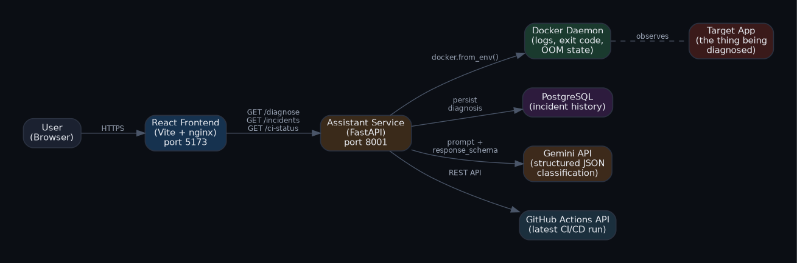
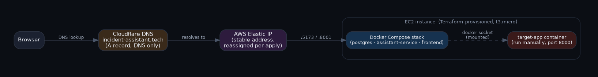

# Incident Assistant

Automated Docker + CI/CD failure diagnosis, powered by Gemini AI.

**Live demo:** [incident-assistant.tech:5173](http://incident-assistant.tech:5173) *(deployed on demand — see [Cloud deployment](#cloud-deployment-aws--terraform) if it's not currently up)*

Incident Assistant watches a containerized application and its CI/CD pipeline, automatically pulls the relevant logs and pipeline status when something breaks, and uses an LLM to explain *what* failed, *why*, and *how to fix it* — in plain English, backed by real evidence, not a guess.

---

## Why this exists

Debugging a failed deployment usually means jumping between `docker logs`, a CI dashboard, and guesswork, manually piecing together what happened. Incident Assistant automates that correlation step: it pulls container state and pipeline status itself, feeds both to an LLM with a strict output schema, and returns a structured diagnosis — failure type, root cause, suggested fix, and a confidence level — instead of a wall of raw logs.

---

## Architecture



**Three independently built pieces:**

| Component | Role |
|---|---|
| `target-app/` | A minimal FastAPI app that gets containerized and deliberately broken — this is what the tool diagnoses |
| `assistant-service/` | The core: fetches Docker + CI evidence, calls Gemini, persists diagnoses, exposes the API the frontend consumes |
| `frontend/` | React dashboard — select a container, trigger a diagnosis, view history and live CI/CD status |

---

## How a diagnosis actually works

1. A container fails (bad config, OOM, unreachable dependency — or you break it deliberately for testing)
2. Docker records the failure itself — exit code, OOM flag, stdout/stderr — no manual log collection needed
3. `assistant-service` pulls that data automatically via the Docker SDK (`docker.from_env()`), plus the latest GitHub Actions run status via the GitHub REST API
4. Both are inserted into a prompt sent to Gemini, with a strict `response_schema` that forces a structured JSON reply — no free-form chat, no unparseable output
5. The result (`failure_type`, `root_cause`, `suggested_fix`, `confidence`) is validated, saved to Postgres, and returned to the frontend

The AI is doing classification over evidence already extracted programmatically — not "chatting" about logs pasted into a prompt.

---

## Tech stack

- **Frontend:** React (Vite), plain CSS — dark, monospace-accented dashboard
- **Backend:** FastAPI (Python) — two independent services
- **AI:** Google Gemini API, structured output via `response_schema`
- **Database:** PostgreSQL + SQLAlchemy
- **Containerization:** Docker, Docker Compose
- **CI/CD:** GitHub Actions (build + push to GHCR)
- **Infrastructure:** Terraform (AWS EC2 + Elastic IP)
- **DNS:** Cloudflare

---

## Quick start (self-hosted, local machine)

Requirements: Docker Desktop, Docker Compose, a [Gemini API key](https://aistudio.google.com/apikey), and a [GitHub personal access token](https://github.com/settings/tokens) (`repo` scope) if you want live CI status.

```bash
git clone https://github.com/Yogesh07garg/ai-incident-assistant.git
cd ai-incident-assistant

cp .env.example .env
# edit .env and fill in:
#   GEMINI_API_KEY=...
#   GITHUB_TOKEN=...
#   GITHUB_REPO=your-username/your-repo

docker compose up --build
```

This starts three services: PostgreSQL, `assistant-service` (port `8001`), and the frontend (port `5173`).

> The repository's committed `docker-compose.yml` defaults the frontend's API address to `http://localhost:8001`, so this works out of the box for anyone cloning it. No changes needed for local use.

**Build and run a target container to diagnose** (kept separate from the core stack, since this is the thing being diagnosed, not infrastructure):

```bash
cd target-app
docker build -t target-app .
docker run -d -p 8000:8000 -e REQUIRED_API_KEY=test123 target-app
```

Open **http://localhost:5173**, select the container from the dropdown, and click **Diagnose**.

### Triggering failure scenarios

| Scenario | Command |
|---|---|
| Missing environment variable | `docker run -d -p 8000:8000 target-app` (omit `-e REQUIRED_API_KEY`) |
| Out-of-memory kill | `docker run -d -p 8000:8000 --memory=6m target-app` |
| Unreachable dependency | Start the container normally, then `curl http://localhost:8000/dependency-check` |

---

## Environment variables

| Variable | Required | Description |
|---|---|---|
| `GEMINI_API_KEY` | Yes | Google Gemini API key, used for diagnosis generation |
| `GITHUB_TOKEN` | No | GitHub personal access token (`repo` scope) — enables the live CI/CD status panel |
| `GITHUB_REPO` | No | `owner/repo` — which repository's Actions runs to display |
| `DATABASE_URL` | No | Defaults to the Docker Compose–provisioned Postgres instance |

Without `GITHUB_TOKEN`/`GITHUB_REPO`, the app still works — the CI/CD panel simply won't render.

---

## Cloud deployment (AWS + Terraform)



Infrastructure is defined in `infra/main.tf` — provisions a security group, an SSH key pair, an EC2 instance (`t3.micro`), and an **Elastic IP** for a stable address across redeploys.

```bash
cd infra
terraform apply
```

SSH into the instance using the generated key, install Docker, clone the repo, recreate the `.env` files (never committed — see [Environment variables](#environment-variables)), and run the same `docker compose up --build` flow as above, then build and run `target-app` manually.

**DNS:** the domain (`incident-assistant.tech`) is managed through **Cloudflare**, with an `A` record pointed at the current Elastic IP, kept in **"DNS only"** mode (not proxied) since the app is served on non-standard ports (`5173`/`8001`) that Cloudflare's free proxy tier doesn't forward.

> **A fresh `terraform apply` after `terraform destroy` allocates a brand-new Elastic IP and an empty instance.** The full cold-start checklist — installing Docker, cloning, recreating secrets, updating the Cloudflare A record, and fixing the frontend's baked-in API address — is written up step by step in [`docs/Redeployment_Guide.pdf`](./docs/Redeployment_Guide.pdf).

**Cost note:** sized for short-lived demo use, not 24/7 hosting. Run `terraform destroy` when not actively demoing it — the Elastic IP only stays free while attached to a running instance.

---

## API reference (`assistant-service`)

| Endpoint | Method | Description |
|---|---|---|
| `/health` | GET | Service health check |
| `/containers` | GET | List containers available to diagnose |
| `/logs/{container_id}` | GET | Raw logs, exit code, and OOM status for a container |
| `/diagnose/{container_id}` | GET | Full AI diagnosis — fetches evidence, calls Gemini, persists, returns result |
| `/incidents` | GET | Diagnosis history, most recent first |
| `/ci-status` | GET | Latest GitHub Actions run — status, conclusion, per-step breakdown |

---

## Design decisions worth knowing

- **CI status is repository-scoped, not container-scoped.** The panel reflects the latest pipeline run generally — it isn't (yet) tied to which specific build produced the container being diagnosed. Correlating a running container back to the exact CI run that built it (via image tagging/labels) is a natural next step.
- **The AI is instructed to say "uncertain" rather than fabricate a cause** when the evidence is ambiguous — enforced via an explicit category in the classification schema, not just prompt wording.
- **CORS is intentionally permissive** for ease of self-hosting. Tighten this if exposing the service beyond local/trusted use.
- **Deployment today is CI (build + push) plus a manual deploy step**, not full continuous deployment. Automating the deploy stage (SSH-based redeploy on a successful build) is a documented next iteration, not an oversight.
- **The repo's committed `docker-compose.yml` always defaults to `localhost`.** The live deployment's server-side copy is edited separately to point at the production domain and is never pushed back — this keeps the repo friendly for anyone else cloning it.

---

## Roadmap

- [ ] Kubernetes-based failure scenarios (pod-level: CrashLoopBackOff, ImagePullBackOff, probe failures)
- [ ] Automated deployment stage in the CI pipeline (currently manual)
- [ ] Per-container CI run correlation via image tagging
- [ ] Reverse proxy (nginx) + HTTPS for a stable, port-free public URL

---

## License

MIT
